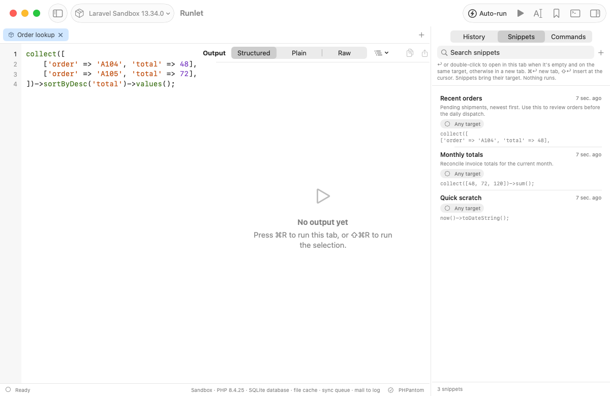
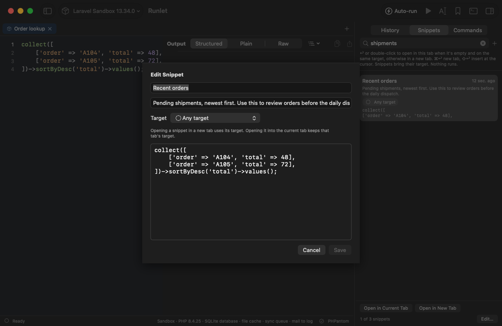

# Personal snippet descriptions

Implemented in [#52](https://github.com/filipac/runlet/issues/52).

Save the selected code or whole tab with **Save as Snippet…** (⌥⌘S). Personal snippets now offer **Description (optional)** below the label. Select a personal snippet in **Snippets** (⇧⌘L) and choose **Edit…** to change or clear it. Saving trims surrounding whitespace; an empty description is omitted.

Descriptions appear below labels in the Snippets panel and in **Open Anything** (⌘P, `#` to search snippets). Both searches include descriptions as well as their existing label/code matches. Long descriptions use two lines in the library; hover them to read the complete text.

**Duplicate** keeps the description. **Copy to Personal** keeps a project snippet's `@description` and target association, without changing the project file. Project snippets continue to read and write their existing docblock metadata; see [project snippets](project-snippets.md).

Descriptions are optional metadata in `State/snippets.json`. Existing version-1 libraries without the field remain readable, with no migration or schema change. The MCP `list_snippets` and `get_snippet` tools return `description` when present, and `list_snippets` includes it in search. MCP `add_snippet` keeps its existing arguments and saves without a description.

Saving, editing, duplicating, copying, opening, and restoring snippets never runs code. An explicit Run keeps the selected target's normal approval rules.

A personal snippet whose code starts with a docblock of `@input` lines asks for those values when it opens; see [parameterised snippets](snippet-inputs.md) ([#14](https://github.com/filipac/runlet/issues/14)).

A personal snippet's context menu also has **Save as Artisan Command…** and **Save as Test…**, which write it into its associated project (or the current tab's) as a reviewable class or test through a save panel, running nothing; see [promote a snippet](promote-snippets.md) ([#39](https://github.com/filipac/runlet/issues/39)).

## SQL snippets

Saving from an [SQL tab](sql-tabs.md) makes an **SQL snippet** ([#130](https://github.com/filipac/runlet/issues/130)): the sheet reads **Save SQL Snippet**, and the snippet keeps `"language": "sql"` in `State/snippets.json`. PHP snippets don't write the key, so libraries saved before snippets had a language load unchanged, as PHP. SQL snippets show an **SQL** badge and open as SQL tabs (in the current tab, it switches to SQL); they have no `@input`s. Duplicate, Copy to Personal, and History's Save as Snippet keep the language. MCP's `list_snippets` and `get_snippet` return `language` (`php` or `sql`), and `add_snippet` takes an optional `language`.

An SQL snippet can also keep **the connection** it opens on, by name ([#149](https://github.com/filipac/runlet/issues/149); `"connection": {"kind": "application" | "saved", "name": "…"}`; libraries without the key load unchanged). The Save SQL Snippet sheet keeps the tab's connection unless you turn it off, **Edit…** changes or removes it, and Duplicate, Copy to Personal, and History's Save as Snippet keep it. `get_snippet` returns only its name, as `connection`. See [SQL tabs ▸ Snippets](sql-tabs.md#snippets).

## MongoDB snippets

Saving from a [MongoDB tab](mongodb.md#snippets) keeps `"language": "mongodb"` and the
connection, like SQL snippets. A MongoDB snippet's code may start with `//` metadata lines;
its `// @input` lines ask for values that fill `{"$input": "name"}` placeholders as JSON values
([#207](https://github.com/filipac/runlet/issues/207)). It shows the **MONGODB** badge.

## Screenshots

## Validation

**38 focused package tests passed** (`PersistenceTests`, `ProjectSnippetsTests`, and MCP approval/catalog/report checks). Persistence checks cover loading old libraries, a mixed old/new library after saving and reloading, Unicode descriptions, clearing, and explicit null descriptions. **6 native library UI tests passed**, including the existing keyboard, history, palette, and file-reload checks. The new checks exercise saving, searching, editing, restarting, opening through the palette, clearing, and preserving project descriptions when copying and duplicating. They use scratch data; the save/edit/open test verifies that code with a file-writing side effect never executes.

**34 MCP end-to-end checks passed** through the bundled CLI and native Debug app, including description-only search, description reads, and legacy entries without the field. Existing approval/cancellation flows also passed. These use scratch data, a local fixture and sandbox runs; Docker and real SSH execution were not exercised for this change.

To reproduce the native screenshots, run `python3 scripts/snippet-description-screenshots.py /path/to/Runlet.app /path/to/output` against a Debug build. It seeds a temporary snippet library and uses `RUNLET_DEBUG_STEPS`/`RUNLET_SNAPSHOT_DIR`; no code runs.
