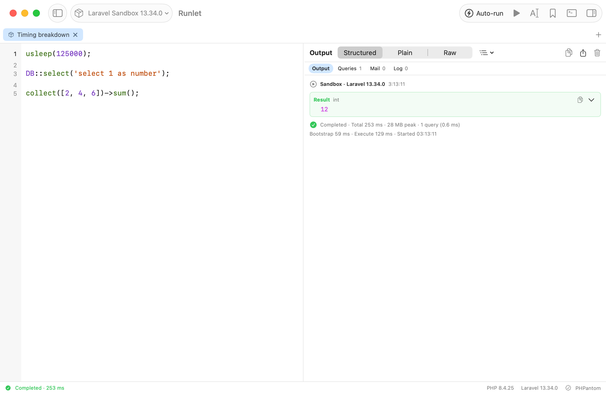
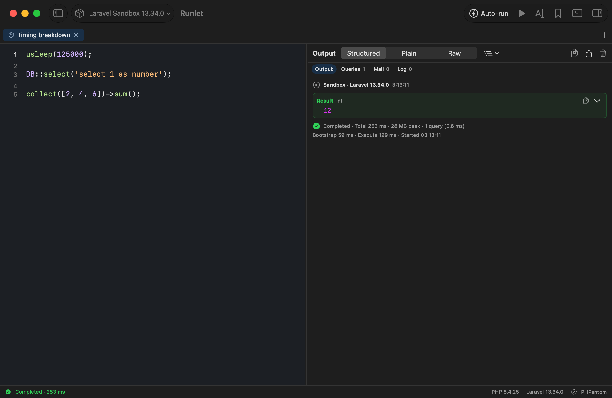

# Run timing breakdown

Implemented in [#9](https://github.com/filipac/runlet/issues/9).

After a run, Structured output shows **Total**, peak memory, and query count/time, followed by available **Bootstrap** and **Execute** durations and **Started** time. Hover the finished row or the completed/failed/stopped status at the bottom of the window for all values, including the full local start date/time. The same details are available to accessibility tools.

| Metric | Meaning |
| --- | --- |
| Started | Wall-clock time on this Mac when the execution session began, before launching its process. Displayed in the Mac's local time zone. Preparation before an execution session exists has no start time. |
| Bootstrap | The runner's reported framework/driver boot duration, in milliseconds. |
| Execute | The runner's reported execution phase, in milliseconds, including finishing its output and instrumentation. |
| Total | Host monotonic elapsed time for the execution session, including process launch, runner overhead, transport, and completion. |
| Peak memory | The PHP runner's reported peak memory. |
| Queries | Accepted query records and their recorded time. Query time is already part of execution; it is not added to total again. |

Phase timings and total are measured by different clocks with rounded milliseconds. They are not expected to sum exactly, especially over Docker or SSH. No timing measurement makes an additional connection or run.

**Unavailable** means the runner did not report that metric. A reported zero remains `0 ms`. Early `exit()`/`dd()` and fatal shutdowns currently report no execute duration; a stopped or disconnected process may have only its bootstrap duration. Bootstrap failures may report neither phase. No missing duration is inferred from total time or carried over from an earlier run.

Clear Output removes output and inspector records, but the completed status keeps its query count/time until the next run. Beginning the next run resets those metrics. Loading/importing/restoring code still never executes it; explicit Run and production approvals retain their existing behavior, with the existing sandbox-only auto-run opt-in unchanged.

The new completion fields are optional. Older saved completion records and runner frames without timing fields remain readable; no protocol version or persistence schema change is required.

## Screenshots

## Validation

Focused package checks cover old/new completion decoding; received zero/full/absent timings; cancellation, pre-launch failure, and incomplete transport; real PHP normal execution, runtime errors, `exit()`, and `dd()`; and the existing production guard. Native checks run an isolated Laravel sandbox with a query, compare the finished row and status details, clear output, then run a query-free error and early exit to verify that metrics do not leak across runs.

Executed checks: **38 focused package tests passed** (including the SSH CLI fixture) and **4 native UI tests passed**. Three separate local-Laravel fixture checks were skipped because their fixture dependencies were absent; real Laravel query/timing behavior was exercised in the native sandbox test. PHP execution checks ran on host PHP 8.4.25 and PHP 7.4; screenshots used the sandbox on PHP 8.4.25. No live Docker or real SSH-server run was performed for this change.

Reproduce screenshots with `python3 scripts/timing-screenshots.py /path/to/Runlet.app /path/to/output` against a Debug build. It uses a temporary `RUNLET_DATA_DIR` and native `RUNLET_DEBUG_STEPS`/`RUNLET_SNAPSHOT_DIR` hooks, explicitly runs only the seeded sandbox code, then captures both appearances.
