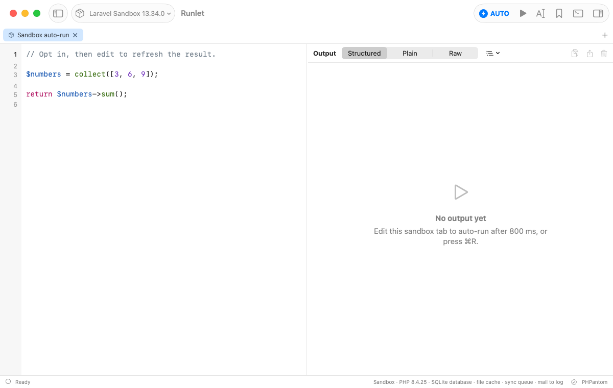

# Sandbox Auto-Run

In a [Laravel Sandbox](laravel-sandbox.md) tab, Runlet can run the whole tab each time you stop typing, so the result follows your code as you write it. Auto-run is off by default, and only the sandbox has it.

## Turning It On

Click **Auto-run** in a sandbox tab's toolbar to turn it on for that tab: the button reads **AUTO** while it's on. Click it again to turn it off.



## How It Runs

Turning auto-run on doesn't run the code that's already in the editor. Your next edit does:

- **800 ms after your last edit,** Runlet runs the whole tab, whatever is selected, and whatever Run prefers.
- **Runs never overlap.** An edit during a run waits for it to finish, then the latest code runs.
- **Run and Run Selection** cancel the pending automatic run and run as usual.
- **Stop** stops the current run and cancels the pending one.
- **Empty code doesn't run,** and errors show in the output as usual: fix the code, and the next edit runs it again.


## When Auto-Run Turns Off

Auto-run belongs to one tab and starts off. It turns off when the tab's code is replaced, and it is never saved:

- New, duplicated, and reopened tabs, tabs restored with your session, and tabs from a workspace start with it off.
- Loading code from History, a snippet, an import, or a file on disk turns it off.
- Switching the tab's target turns it off, even when you switch back to the sandbox. Switching the tab to SQL turns it off too.

Auto-run is only for the sandbox. Local projects, Docker and SSH targets, production targets, and SQL tabs don't have it.

> [!WARNING]
> Only your edits trigger an automatic run: opening, restoring, or selecting a tab never does. But sandbox code can still have side effects, such as writing files or calling HTTP APIs. Read the code before you turn auto-run on.

## For developers

Auto-run was implemented under [#30](https://github.com/filipac/runlet/issues/30); this page was rewritten under [#289](https://github.com/filipac/runlet/issues/289), and the [Laravel Sandbox](laravel-sandbox.md#auto-run) page introduces it.

- `TabModel` keeps the opt-in and the cancellable 800 ms task outside `TabState`, so sessions and workspaces never store it; `EditorController` marks programmatic loads apart from editor edits; `AppModel` cancels pending work on Run, Stop, and close, and checks again across asynchronous preparation that the tab is still a sandbox tab. The delay uses Swift's cancellable [Task.sleep](https://developer.apple.com/documentation/swift/task/sleep(for:tolerance:clock:)).
- An AI client's run (MCP) keeps its `RunObserver` callbacks and disarms a pending auto-run when an explicit run begins.
- **Validation** (2026-10-03, the Debug app with the sandbox on local PHP): six `SandboxAutoRunUITests` scenarios plus the Run Selection and Stop scenarios, and the `ProductionGuardTests` package tests, also after merging the REPL work and MCP. The native scenarios cover opt-in without an immediate run, rapid edits coalescing, full-tab evaluation with a selection, Run cancelling a pending evaluation, turning it off, per-tab state, session restore, queued edits without overlap (checked with a PHP file lock), Stop, close, and reopen, disk reloads, loading History into an enabled tab, target eligibility and reset, and the production confirmation. They use a scratch `RUNLET_DATA_DIR`, real editor events, and PHP marker files rather than the toolbar alone. Docker and SSH tabs were checked for the option's absence; the Docker-backed sandbox and workspace import weren't run in that pass (workspace and session tabs are built from `TabState`, which has no opt-in). After merging MCP, 19 production and MCP policy and report tests passed, and `scripts/mcp-e2e/driver.py` passed all 31 checks.

Reproduce the UI checks after `xcodegen generate`:

```sh
xcodebuild -project Runlet.xcodeproj -scheme Runlet -configuration Debug \
  -derivedDataPath build/DerivedData \
  -only-testing:RunletUITests/SandboxAutoRunUITests \
  -only-testing:RunletUITests/RunletUITests/testRunSelectionOnly \
  -only-testing:RunletUITests/RunletUITests/testStopLongRunningRun test
```

```sh
swift test --package-path Packages/RunletKit --filter ProductionGuardTests
```
