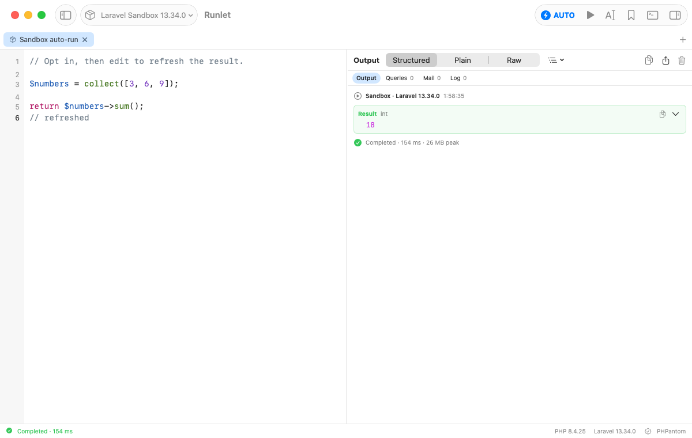
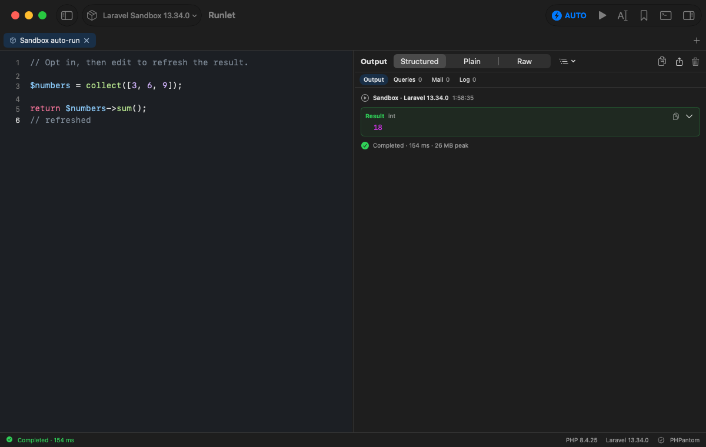

# Sandbox auto-run

Implemented under [#30](https://github.com/filipac/runlet/issues/30).

In a **Laravel Sandbox** tab, click **Auto-run** in the toolbar to opt in for that tab. The button shows **AUTO** while enabled; click it again to turn it off. Enabling does not run the code already in the editor. The next editor edit starts an 800 ms debounce. Each subsequent edit restarts that delay, then Runlet evaluates the entire tab, regardless of the selection or the Run-prefers-selection setting.

An edit during an active run waits for it to finish before evaluating the latest code; automatic runs never overlap. **Stop** cancels pending automatic execution as well as stopping the current run. Explicit **Run** and **Run Selection** cancel pending automatic execution and retain their normal selection behavior. Empty code does not run. Errors appear in the normal output pane; another edit can run the corrected code.

Auto-run is off by default and belongs to one tab. New, duplicated, reopened, session-restored, and workspace-imported tabs start with it off. Loading code from history, snippets, imports, or disk turns it off. Switching targets also turns it off, including switching back to the sandbox. It is unavailable on local projects, Docker profiles, SSH profiles, or production targets, and on [SQL tabs](sql-tabs.md): switching a tab to SQL turns it off. The sandbox itself keeps its usual choice of local PHP or a dedicated sandbox Docker runtime; opting in does not connect to a project or server.

Only editor edits after explicit opt-in trigger execution. Opening, importing, restoring, selecting, or enabling a tab does not execute it. Sandbox PHP can still have side effects: review the code before opting in.

## Screenshots

Enabling auto-run leaves the existing code idle until the next edit:


After an editor edit, the result refreshes (light and dark appearances):





## Validation

Validated on 2026-10-03 with the Debug native app and the sandbox running on local PHP. Eight focused UI tests passed together: six `SandboxAutoRunUITests` scenarios plus the existing Run Selection and Stop scenarios. Four `ProductionGuardTests` package tests also passed, including a recheck after merging the REPL work from `main`. The opt-in/restore and target/production UI scenarios were also rechecked on the merged branch, followed by the queue/non-overlap and Stop/close scenarios after the final cancellation check.

The native scenarios cover opt-in without immediate execution, rapid edit coalescing, full-tab evaluation with a selection, explicit Run cancelling pending evaluation, disabling, per-tab state, session restore, queued edits without overlap (checked with a PHP file lock), Stop/close/reopen cancellation, disk reloads, history loading into an enabled tab, target eligibility/reset, and production confirmation. They use scratch `RUNLET_DATA_DIR` storage, real editor events, and PHP marker files rather than inferring execution from the toolbar alone.

Docker/SSH tabs were checked for absence of the option and automatic execution; no live Docker/SSH target execution was needed or claimed. The dedicated Docker-backed sandbox fallback and workspace import were not exercised in this focused run. Workspace/session/new-tab code constructs `TabModel` from `TabState`, which contains no auto-run opt-in; the native session/reopen tests verify that reset in actual app flows.

Reproduce the focused UI checks after `xcodegen generate`:

```sh
xcodebuild -project Runlet.xcodeproj -scheme Runlet -configuration Debug \
  -derivedDataPath build/DerivedData \
  -only-testing:RunletUITests/SandboxAutoRunUITests \
  -only-testing:RunletUITests/RunletUITests/testRunSelectionOnly \
  -only-testing:RunletUITests/RunletUITests/testStopLongRunningRun test
```

```sh
swift test --package-path Packages/RunletKit --filter ProductionGuardTests
```

Integration with the MCP run entry point preserves its `RunObserver` callbacks and disarms pending editor auto-run when an explicit run begins. After merging MCP, the opt-in/restore and Stop/close native scenarios passed again, and 19 targeted production/MCP policy and report tests passed. The existing `scripts/mcp-e2e/driver.py` probe then passed all 31 checks against the merged Debug build with scratch data, including approved sandbox/local runs and declined, cancelled, and expired requests.

## Implementation

`TabModel` keeps opt-in and debounce tasks outside `TabState`; `EditorController` marks programmatic loads separately from editor edits; `AppModel` cancels pending work on execution/close and checks eligibility again across asynchronous preparation. The delay uses Swift's cancellable [Task.sleep](https://developer.apple.com/documentation/swift/task/sleep(for:tolerance:clock:)).
