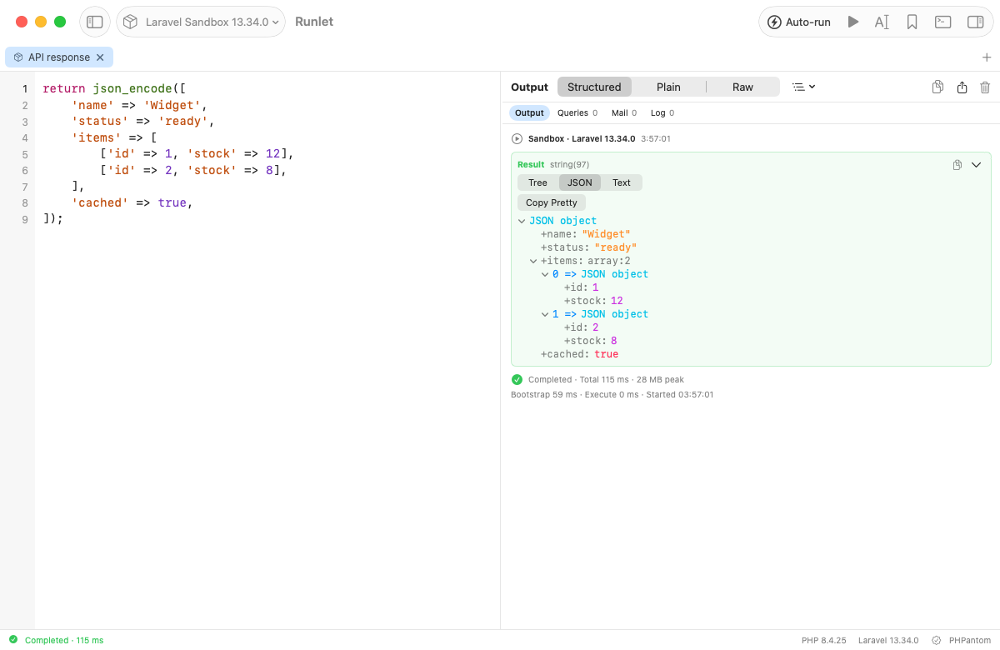
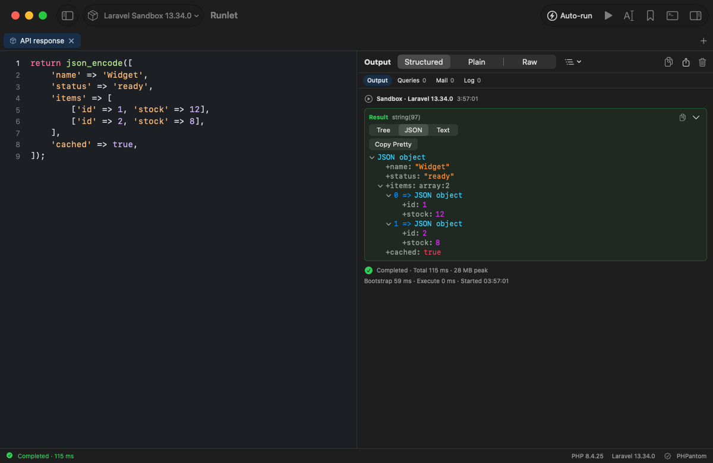
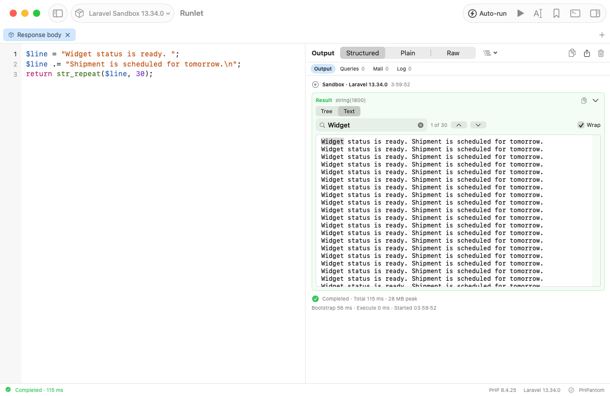
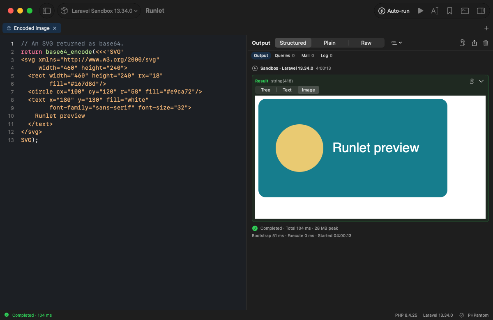
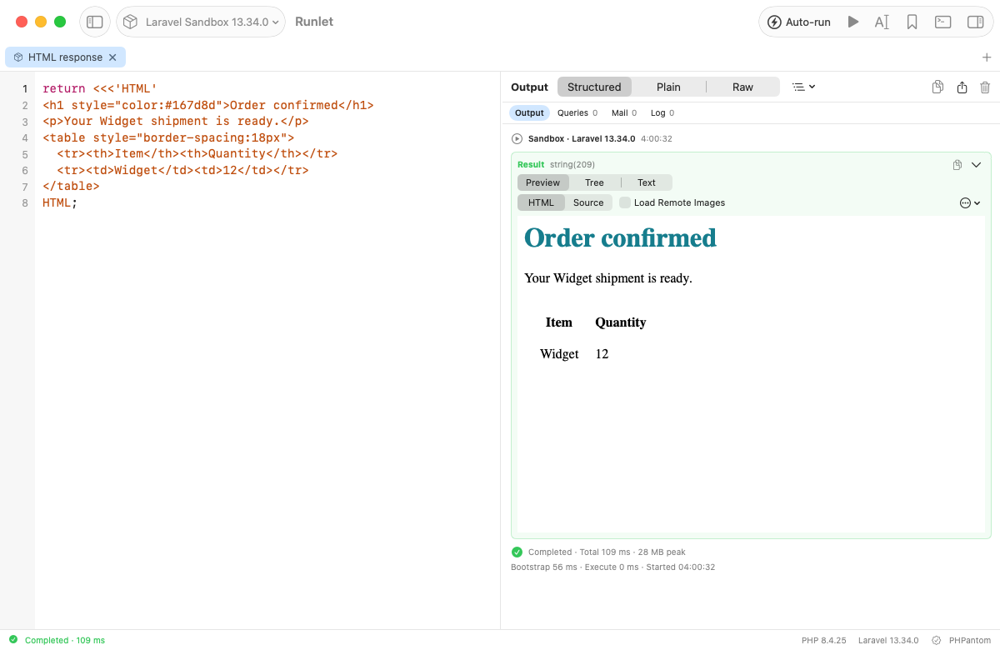

# Specialized string viewers

Tracked by [#7](https://github.com/filipac/runlet/issues/7).

Structured result and dump cards, and inspector values rendered by `ValueContentView`, offer extra views for bounded strings. The original **Tree** remains available. Plain and Raw output retain their existing transcript behavior. Nested tree leaves remain ordinary value rows.

- **JSON:** a recognized JSON document gets a JSON tab with an expandable tree and **Copy Pretty**. The tree and pretty copy retain original numeric literals, including large integers and precise decimals. Members retain source order. Documents beyond 32 nesting levels or roughly 2,048 values stay in Tree/Text; JSON trees show at most 200 children per container and mark omitted children.
- **Text:** long strings (at least 1,000 UTF-8 bytes or 10 newlines) open here automatically. Text is selectable and scrollable, wraps by default, and offers literal, case-insensitive search, match counts, and previous/next navigation. Short strings can also select Text. Runner truncation is shown alongside the retained text.
- **Image:** base64 PNG/JPEG/SVG, their base64 data URLs, and binary PNG/JPEG strings encoded by the runner get an image tab. Raw SVG is also recognized. Raster previews decode a thumbnail of at most 1,024 pixels and refuse invalid images or dimensions above 4,096 on either side. SVG loads as an image in the existing restricted web view, with scripts and remote resources blocked.
- **Preview:** strings starting with common HTML tags offer the existing HTML viewer, including Source and Copy HTML. Scripts stay disabled. Remote images stay blocked unless the user selects the existing Load Remote Images option. Runner-rendered previews keep their existing default view.

Recognition uses only the string already delivered to Swift. Input is limited to 64 KiB (decoded bytes for runner-encoded binary strings); no files or URLs are resolved. Truncated or budget-limited strings retain Text but do not offer JSON, image, or detected HTML previews. Switching views never executes PHP, connects to a target, or changes auto-run or production confirmations.

## Validation

On 2026-10-03, **15 focused package tests and 3 native UI tests passed**. Native snapshots use the actual Laravel sandbox (PHP 8.4.25, Laravel 13.34.0).

`StringViewersTests` covers JSON types and exact number literals, pretty formatting, UTF-8 BOM, malformed/deep/wide documents, child limits, byte bounds, truncated values, PNG/JPEG/SVG encodings, HTML recognition, and literal Unicode search. Existing value table, output export, and production guard suites also run unchanged.

Native tests use whole-snippet paste (restoring the clipboard), rather than typing large fixtures character by character. `testSpecializedJSONAndTextViewers` exercises actual sandbox JSON output, Tree/JSON switching, clipboard pretty copy, long-string defaults, search counts/navigation/no-match, and Wrap. `testSpecializedImageAndHTMLViewers` exercises actual base64 and binary PNG, JPEG data URLs, malformed/oversized raster fallback, SVG, and HTML Preview/Source with remote images initially off. The existing restore-without-running test verifies the execution boundary.

The reproducible DEBUG capture script uses scratch session state, explicit sandbox Run, and native app snapshots:

```sh
python3 scripts/string-viewer-screenshots.py /path/to/Runlet.app /path/to/output
```

No Docker or live SSH target was exercised for this Swift-side change. The preview restriction code is reused; this issue's tests do not independently audit WebKit's network blocking.






