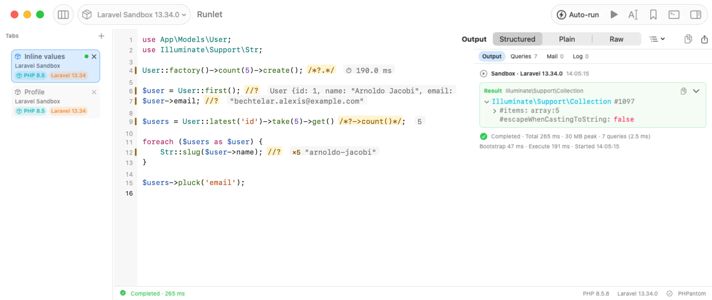
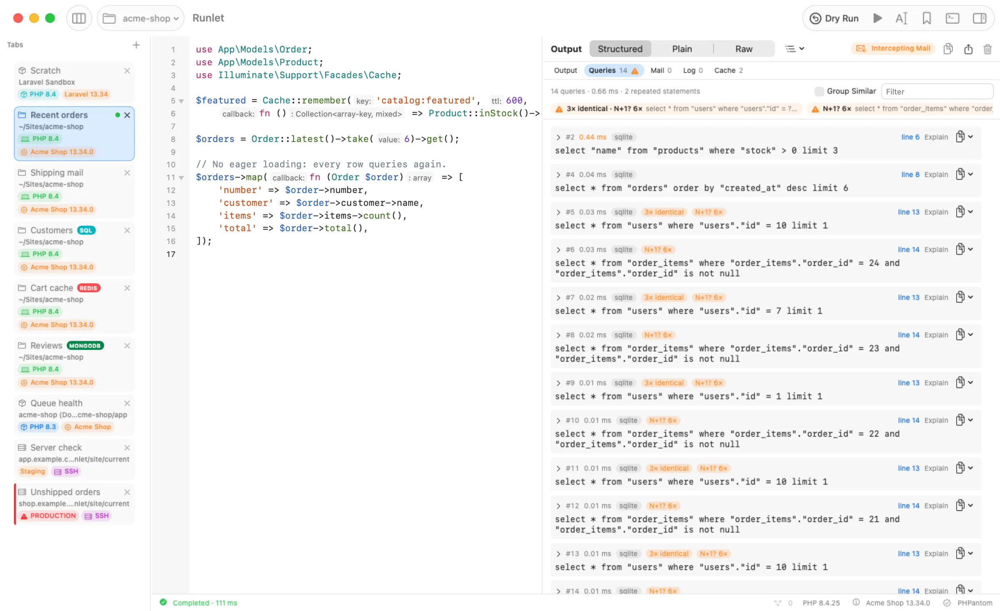
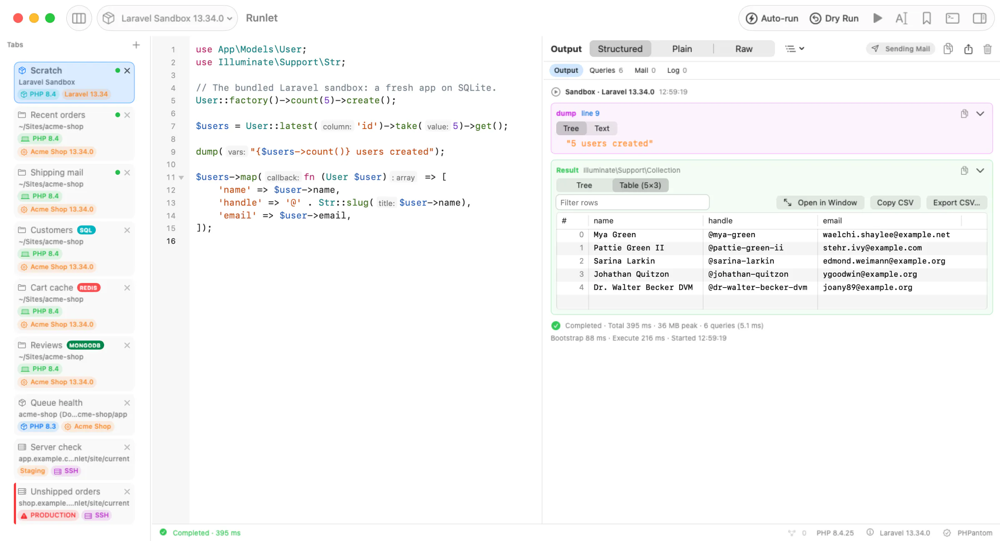
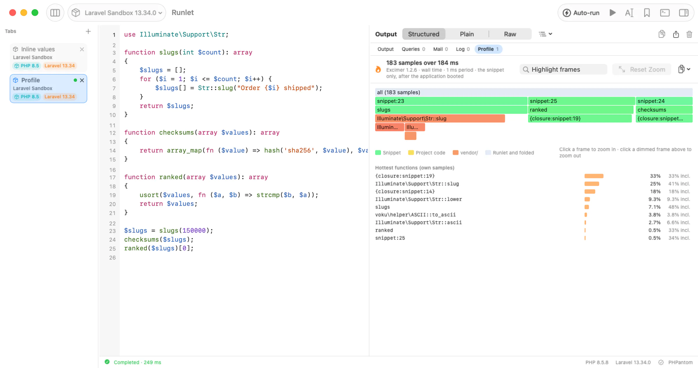
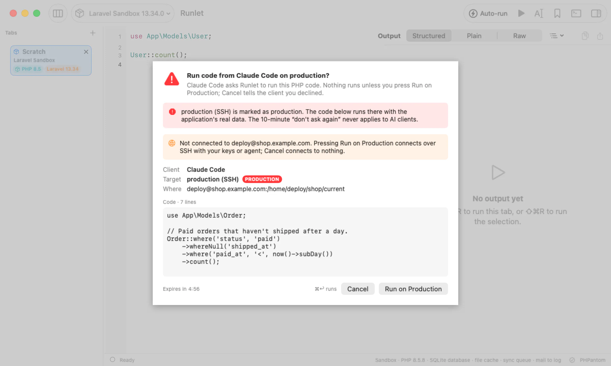

<p align="center">
  
</p>

<h1 align="center">Runlet</h1>

<p align="center">
  <strong>A native macOS PHP scratchpad for running code inside your real projects.</strong><br>
  Run PHP anywhere. Inspect everything. Experiment insanely fast.
</p>

<p align="center">
  <a href="https://github.com/filipac/runlet/releases/latest"><strong>Download for macOS</strong></a>
  &nbsp;·&nbsp; <a href="#install">Install notes</a>
  &nbsp;·&nbsp; <a href="https://filipac.github.io/runlet/">Website</a>
  &nbsp;·&nbsp; <a href="#documentation">Docs</a>
</p>

<p align="center">
  macOS 26 or later · Apple silicon and Intel · Free and open source (MIT) · Early preview
</p>

Open a Laravel, Symfony, or WordPress project, write a few lines of PHP, and press ⌘R. The snippet runs inside your application, with its models, services, configuration, and database connection ready, on your Mac, in a Docker container, or on a server over SSH. Runlet shows the result next to your code, along with the SQL it ran, the mail it sent, and the logs it wrote.

**Stop creating temporary routes, commands and `dd()` calls just to answer a question about your application.**

<picture>
  <source media="(prefers-color-scheme: dark)" srcset="website/assets/shots/magic-comments-dark-2400.webp">
  
</picture>

Runlet isn't an IDE. Keep writing your app in PhpStorm, VS Code, or Zed; Runlet sits next to your editor as the place where you try things out, and file paths in its output open at their line in your editor.

**Install:** download the `.dmg` from [Releases](https://github.com/filipac/runlet/releases/latest) and drag Runlet to Applications. It's an early release and not notarized yet, so macOS asks before the first launch; [here's how to open it](#first-launch).

> **Early preview.** Runlet was built quickly with AI assistance. Expect rough edges, and please [report issues](https://github.com/filipac/runlet/issues).

## Why Runlet?

**Explore your application.** Write a line, add `//?`, and run it. The value appears at the end of the line, and the output pane has the whole model to expand.

```php
use App\Models\User;

User::query()->latest()->first(); //?
```

**Debug a query.** Run it and open **Queries**: every statement with its bindings, time, connection, and the snippet line that ran it, with hints for repeated statements and N+1 patterns. **Explain** turns a captured query into a ready-to-run tab that asks the database for its plan.

**Try it where it matters.** Switch the tab's target from your local project to its Docker container or a staging server over SSH (⌘P), and run the same snippet there. Production targets ask first.

**Let an AI agent investigate, safely.** Claude Code, Cursor, and other MCP clients can propose PHP to run against your project. Runlet shows you the code and where it would run, and runs it only when you approve.

### Built for PHP developers who…

- open `php artisan tinker` many times a day;
- add a temporary route or command just to look at something;
- add `dd()` and remove it five minutes later;
- want to try code against the real application, not a blank playground;
- debug database behavior by running the query and looking at what happened;
- want AI agents to run diagnostic PHP without handing them the keys.

### Where Runlet fits

| Tool | Good at | Trade-off |
| --- | --- | --- |
| `php artisan tinker` | A REPL in the terminal; state carries over from line to line. | Results are text in a terminal. Runlet can open Tinker for you too (**Open REPL**). |
| Temporary routes, commands, or scripts | Full control, run exactly where the app runs. | They change the project, and someone has to remove them. |
| `dd()` in application code | Quick and always available. | It edits app code and ends the request; it has to come out again. |
| IDE scratch files | Right next to your code. | How they boot your framework, and which PHP and environment they use, depends on the IDE and its plugins. |
| **Runlet** | A snippet runs inside your app on the target you pick, and its result, queries, mail, logs, timings, and profile show up next to it. Nothing is written into your project. | macOS only. Each run is a fresh PHP process, so variables don't carry over between runs (use Open REPL when you want that). |

## Inline values with magic comments

Magic comments show values in the editor while the code runs, without `dump()` calls or temporary variables:

```php
use App\Models\User;

$user = User::find(42); //?
$user->subscriptions; //?
$user->subscriptions /*?->where('active', true)->count()*/;

foreach ($user->subscriptions as $subscription) {
    $subscription->renews_at; //?
}
/*?.*/
```

| Comment | Shows |
| --- | --- |
| `//?` at the end of a line | The line's value: an expression, an assignment's value, a `return`, or an `echo`. `✓` on a line without a value, when it's reached. |
| `/*?*/` after an expression | That expression's value: `$price * $qty /*?*/ + $shipping` shows `$price * $qty`. |
| `/*?->count()*/` | A projection of the value before it. The code still gets the value itself. |
| `/*?.*/` | Milliseconds since the previous `/*?.*/`, or since the snippet started. |

A line that runs more than once shows `×N` and its latest value; hover it (or Edit ▸ Show Inline Value) for the value tree and every hit. Values stream in while the code runs, on every target, and work with Run Selection (⇧⌘R). Adding magic comments never changes what the code does: the runner inserts probes at their byte offsets and never re-prints your code, and places where a probe could change behavior are skipped with a short reason. Settings ▸ General ▸ Magic Comments turns them off. Details: [docs/compatibility.md](docs/compatibility.md#magic-comments-10).

## Run inside your real application

Open a project folder (⇧⌘O, or `runlet .` in a terminal). Runlet detects the framework and boots it for every run (Laravel the way an Artisan command does, WordPress the way WP-CLI does), so a snippet starts with the application ready:

```php
use App\Models\User;

$user = User::find(1);
$user->subscriptions;
```

No route, controller, or temporary command. The last expression is the result, as in Tinker.

| Project | Detected by | Snippets start with |
| --- | --- | --- |
| Laravel, Lumen, Laravel Zero | `bootstrap/app.php`, plus `artisan` or `laravel-zero/framework` | `$app` |
| WordPress (classic, Bedrock, `public/wp`) | `wp-load.php` in the usual places | `$wpdb` |
| Symfony | `bin/console`, plus `src/Kernel.php` or `config/bundles.php` | `$kernel`, `$container` |
| Composer projects | `composer.json` or `vendor/autoload.php` | the Composer autoloader |
| Anything else | | plain PHP |

For anything else, a **project driver** teaches Runlet how to boot your app: one PHP class in the project's `.runlet/` folder that boots it, hands snippets their variables, and can add project commands, host commands that run on your Mac, and inspector sections. See the [driver guide](docs/drivers.md), which also covers porting a Tinkerwell driver.

The runner is streamed to PHP on standard input, so Runlet writes no files into your project or container, and it never runs Composer in your project. Completion comes from [PHPantom](https://github.com/PHPantom-dev/phpantom_lsp), which indexes your project: models, relations, and columns complete as you type, also for Docker and SSH targets that have a checkout on your Mac.

## See everything your code touched

Running PHP is half of it. Runlet shows what happened during the run, in one place next to the output:

- **Output and result:** printed output, `dump()` and `dd()`, and the returned value as an expandable tree, a sortable table for rows and collections, or Plain and Raw text. Strings that hold JSON, images, or HTML get their own viewers.
- **Errors:** exceptions with the snippet line that threw them. `\Runlet\notice()`, `\Runlet\warning()`, and `\Runlet\error()` add your own cards with their line, without ending the run ([snippet API](docs/snippet-api.md)).
- **SQL:** every query with its bindings, time, connection, and the line that ran it; repeated statements and N+1 patterns are flagged. **Explain** opens a new tab that requests the plan (`EXPLAIN QUERY PLAN` on SQLite, `EXPLAIN` on MySQL, MariaDB, and PostgreSQL) and waits for you to press Run.
- **Mail and HTML:** mailables, notifications, views, and HTML responses render in a locked-down preview, with no JavaScript, no navigation, and no remote loads unless you allow them. Turn on mail interception and Laravel builds each message without sending it.
- **Logs** the run wrote, and sections your project driver adds ("Cache", "HTTP calls"…).
- **Timings:** total, bootstrap, and execute time, peak memory, and query time for every run, plus benchmarks and profiles (below).
- **Export:** values as JSON, PHP, or Markdown, tables as CSV, or the whole output to a file.

For example, in a Laravel project:

```php
use App\Models\Order;

Order::query()
    ->where('status', 'pending')
    ->latest()
    ->take(10)
    ->get(); //?
```

The line shows the collection. **Queries** shows the `select` with its bindings and time, and **Explain** next to it opens the plan request in a new tab.

<picture>
  <source media="(prefers-color-scheme: dark)" srcset="website/assets/shots/inspector-queries-dark-2400.webp">
  
</picture>

What is recorded without any setup depends on the framework; see [Supported environments](#supported-environments).

## Run it where your app lives

Your code doesn't have to run inside Runlet's environment. Every tab has a target; switch it from the toolbar or with ⌘P, and output, dumps, errors, and Stop behave the same everywhere.

- **Laravel sandbox.** A fresh Laravel app on SQLite, bundled with Runlet, for trying things without a project.
- **Local projects** on any PHP 7.4 or newer: Herd, Homebrew, or the `php` on your `PATH`. Pick a PHP per project in its settings, or set the default in Settings ▸ PHP.
- **Runlet's own PHP.** No PHP installed? One click downloads a self-contained PHP 8.5.8 (about 26 MB) with the usual Laravel, Symfony, and WordPress extensions, Excimer, and mongodb. Installed PHP always comes first.
- **Docker.** Pick a running container or Compose service, and Browse… for its working directory inside the container. Runlet finds it again after it's recreated, and never silently picks a different one.
- **SSH.** Hosts from `~/.ssh/config`, jump hosts included. ssh-agent and 1Password work as in Terminal; password and two-factor logins stay connected until you disconnect. Snippets run with the server's own PHP in the app's folder, or inside a Docker container on that server.

<picture>
  <source media="(prefers-color-scheme: dark)" srcset="website/assets/shots/hero-dark-2400.webp">
  
</picture>

**Production asks first.** Mark a target as staging or production. Production gets a red badge on its tab, toolbar, and status bar, and every run shows what will run and where before it does: ⌘↩ runs, while ↩ and Esc cancel, so a reflexive Return never runs code on production. A "Don't ask again for 10 minutes" box covers snippet runs on that target only; project commands, shells, and REPLs on production ask every time, and the Commands pane's Tests group is disabled there, since test suites can reset the database. When a run shows that the application itself says it is production (Laravel's `APP_ENV`, Symfony's kernel, WordPress's environment type) and the target isn't marked, the tab offers **Mark as Production**; Runlet never changes the marking by itself. History keeps a PROD badge on runs made on production targets, even after the target changes. See [docs/ssh.md](docs/ssh.md#production-hosts).

## Measure: benchmarks and profiling

**Benchmarks.** `Runlet\bench()` works in any snippet, on every target, with no extension:

```php
use Illuminate\Support\Str;

Runlet\bench(fn () => Str::slug('Ada Lovelace'), 5000, 'Str::slug()');

Runlet\bench([
    'array_map' => fn () => array_map(fn ($x) => $x * 2, range(1, 1000)),
    'foreach' => function () {
        $doubled = [];
        foreach (range(1, 1000) as $x) {
            $doubled[] = $x * 2;
        }
        return $doubled;
    },
], 2000);
```

`bench($callables, int $iterations = 1000, ?string $label = null, ?float $seconds = null)` takes a callable, or up to 20 labeled callables to compare side by side. Its card shows the mean, median, p95, min, max, operations per second, memory, and a histogram of call times, and it returns the numbers in milliseconds. It takes the same first two arguments as Laravel's `Benchmark::measure()`, and Laravel's `Benchmark::dd()` gets a card too.

**Profile without leaving the scratchpad.** Run ▸ **Profile Run** (⌥⌘R) runs the tab and samples the snippet every millisecond, then draws a native flame graph: hover a frame for its function, file, and line, click to zoom, search to highlight, and copy the samples as collapsed stacks. No temporary profiling scripts, no changes to your application, and the app's bootstrap isn't in the profile.

<picture>
  <source media="(prefers-color-scheme: dark)" srcset="website/assets/shots/profile-dark-2400.webp">
  
</picture>

Profile Run uses the [Excimer](https://www.mediawiki.org/wiki/Excimer) extension in the target's PHP. Runlet's own PHP includes it; elsewhere, install it with `pecl install excimer`, `pie install wikimedia/excimer`, or the `php-excimer` package from deb.sury.org or remirepo.

## AI clients (MCP)

**A controlled execution layer between AI tools and real PHP projects.** Let Claude Code, Cursor, or another [MCP](https://modelcontextprotocol.io) client propose PHP to run against your project, while Runlet keeps execution visible and under your control. It isn't shell access for the agent: every run is a PHP snippet you have read, on a target you can see.

1. You turn it on in Settings ▸ AI Clients (it's off by default) and add `runlet mcp` to your client.
2. The client can list your targets and snippets, read and save snippets, and ask to run PHP.
3. Every run request opens a sheet in Runlet with the client's name, the target and its environment, where it runs (a folder, a container, or `user@host:directory`), and all of the code. ⌘↩ runs exactly that code on exactly that target; Cancel tells the client that nothing ran. A request nobody answers expires after 5 minutes.
4. The client gets the output, dumps, result, and errors with their line. The run also opens in a Runlet tab and is recorded in History.

<picture>
  <source media="(prefers-color-scheme: dark)" srcset="website/assets/shots/mcp-approval-dark-2400.webp">
  
</picture>

The safeguards:

- **Only the Laravel sandbox** can be allowed for the rest of a client's session. Local projects and Docker applications ask every time.
- **Production always asks**, with a red warning and a **Run on Production** button. The 10-minute "don't ask again" for production never applies to AI clients.
- **SSH hosts are never connected silently.** The sheet says when pressing Run connects, and a host that needs a password or a one-time code is refused until you log in yourself.
- **Local only.** Runlet listens on a private Unix socket on your Mac, never on the network, and only accepts processes running as you. Nothing in a request can approve a run.

Approved code runs with the same power as any snippet you run yourself, so read it as you would a pull request. Setup for Claude Code:

```bash
claude mcp add --transport stdio --scope user runlet -- /Applications/Runlet.app/Contents/Helpers/runlet mcp
```

Claude Desktop, Cursor, and the full security model: [docs/mcp.md](docs/mcp.md).

## Everything in Runlet

**Execute**

- Targets: the Laravel sandbox, local projects (PHP 7.4+), Docker containers and Compose services, and SSH servers, with or without a container on the server.
- PHP per project or as the default, from Herd, Homebrew, your `PATH`, or Runlet's own PHP 8.5.8.
- Run (⌘R), Run Selection (⇧⌘R), and Stop. Output as it runs or all at once when it ends (Settings ▸ General ▸ Output), and, if you like, an output pane that stays hidden until a run or hides on Escape.
- [Sandbox auto-run](docs/sandbox-auto-run.md): opt in per sandbox tab to run 800 ms after you stop typing. Off by default, with a visible AUTO badge, and never on local, Docker, or SSH targets.
- [Notifications for long runs](docs/run-notifications.md): a run that takes 10 s or more (you choose) and ends while you're in another app posts a notification with its status, duration, tab, and target, never code or output. Click it to get back to the tab.
- [Dry Run](docs/dry-run.md): a PHP tab's runs happen in database transactions that Runlet always rolls back, then say "Rolled back 3 statements on mysql", with warnings for what a transaction can't undo (MySQL's implicit commits, commits in the code, other connections).

**Inspect**

- Structured, Plain, or Raw output; tables for rows and collections; [string viewers](docs/string-viewers.md) for JSON, long text, images, and HTML.
- `dump()` and `dd()` through your project's VarDumper (or Runlet's own when there is none); exceptions with the snippet line; `\Runlet\notice()`, `warning()`, and `error()` cards that never fail the run. Everything a snippet can use: [docs/snippet-api.md](docs/snippet-api.md).
- SQL queries with timings, bindings, N+1 hints, and [Explain](docs/sql-explain.md); mail previews and interception; logs; driver-defined sections.
- Export as JSON, PHP, CSV, or Markdown.

**Measure**

- [Run timing breakdown](docs/run-timings.md): bootstrap, execute, total, peak memory, and query time.
- `/*?.*/` timings in the editor, `Runlet\bench()` benchmark cards, and Laravel's `Benchmark::dd()`.
- Profile Run with a native flame graph (Excimer).

**Iterate**

- Magic comments: `//?`, `/*?*/`, `/*?->…*/`, and `/*?.*/`.
- PHPantom completion, hover, signature help, and diagnostics that know your project, plus [code navigation](docs/navigation.md): Go to Definition (F12, ⌘-click) with a read-only peek into vendor code, Find References (⇧F12), code actions such as Import class (⌥↩), inlay hints, and folding.
- [Format Code](docs/format-code.md) (⌥⇧⌘F) with the bundled Mago formatter: no PHP needed, PER, PSR-12, or Laravel style, magic comments kept in place, and an opt-in Format before run.
- History (per project or all), [personal snippets](docs/personal-snippets.md) with descriptions, and [project snippets](docs/project-snippets.md) your team commits in `.runlet/snippets`.
- [Promote a snippet](docs/promote-snippets.md): **Save as Artisan Command…** or **Save as Test…** (Pest or PHPUnit) writes the tab's code into the project as a class or test to review, through a save panel, without running it.
- ⌘P Open Anything (targets, snippets, recent files, run history) and ⇧⌘P Command Palette; every shortcut can be changed. Type `dark`, `light`, or `auto` in ⌘P to switch the appearance.
- Horizontal or vertical tabs, multiple windows, and workspace files. Tabs opened from files follow changes on disk.
- Commands pane: Artisan or console commands, Composer scripts, your own host CLIs, **Open REPL** (the target's Tinker, PsySH, or `php -a`), and **Tests** (run all, one file, or `--filter` with `php artisan test`, Pest, or PHPUnit) in an integrated terminal that uses your login shell.

**Automate**

- The [`runlet` command](docs/cli.md): `runlet .` opens the current folder, `runlet file.php` opens a file, `-t <target>` picks a target.
- `runlet mcp` for AI clients ([docs/mcp.md](docs/mcp.md)).
- [Project drivers](docs/drivers.md) in `.runlet/` for apps Runlet doesn't detect.

## Supported environments

| | Supported |
| --- | --- |
| macOS | 26 or later, Apple silicon or Intel (one universal app) |
| PHP for your projects | 7.4 to 8.5, on your Mac, in a container, or on a server |
| Laravel sandbox | Laravel 13.34.0 on SQLite. Needs PHP 8.3 or later on your Mac, Runlet's own PHP, or Docker (a `php:8.4-cli` container) |
| Frameworks | Laravel, Lumen, Laravel Zero, Symfony, WordPress, and Composer projects are detected; anything else through a [project driver](docs/drivers.md#writing-a-project-driver) |
| Docker | Docker Desktop or OrbStack, through the Docker CLI's current context |
| SSH | Your system `ssh` and `~/.ssh/config`: keys, ssh-agent, 1Password, passwords, two-factor codes, jump hosts |
| Profile Run | PHP with the Excimer extension (included in Runlet's own PHP) |

What the run inspector records without any code:

| Project | Queries | Mail | Logs |
| --- | --- | --- | --- |
| Laravel, Lumen, Laravel Zero | Yes | Yes, with interception | Yes |
| Eloquent without Laravel | Yes | – | – |
| Symfony | Doctrine connections | Symfony Mailer (interception on 6.3+) | – |
| WordPress | Yes (`$wpdb`) | – | – |
| Standalone Doctrine DBAL, plain PDO | One line in a project driver | – | – |

Testbench, Craft, Drupal, Magento, and other frameworks have no built-in driver yet; a project driver can boot them. Verified runtimes, measurements, and known limitations are in [docs/compatibility.md](docs/compatibility.md) and [docs/drivers.md](docs/drivers.md#limitations).

## Install

### Requirements

- macOS 26 or later, on Apple silicon or Intel. Releases are one universal app (arm64 and x86_64); the x86_64 build has been checked under Rosetta, not yet on an Intel Mac.
- PHP is optional: Runlet uses Herd, Homebrew, or the `php` on your `PATH` when it finds one, and otherwise offers to download its own.
- Docker and SSH are optional, needed only for those targets.

### Download

Download `Runlet-<version>.dmg` (drag Runlet to Applications) or the `.zip` from the [latest release](https://github.com/filipac/runlet/releases/latest). Each release has its SHA-256 checksums in `SHA256SUMS.txt`. There is no Homebrew cask.

### First launch

Runlet is currently distributed as an early release and is not yet notarized: releases are ad-hoc signed, without an Apple Developer ID. macOS therefore blocks the app the first time you open it. To open it anyway:

1. Open Runlet once. macOS says it can't verify it.
2. Go to **System Settings ▸ Privacy & Security** and click **Open Anyway** next to the message about Runlet, then confirm.
3. Or remove the quarantine flag in Terminal:

   ```sh
   /usr/bin/xattr -dr com.apple.quarantine /Applications/Runlet.app
   ```

Why this works: browsers mark downloaded files with the `com.apple.quarantine` attribute, and Gatekeeper checks quarantined apps for Apple's notarization before their first launch. Removing the attribute tells macOS you trust this copy, so only do it for a download you trust; you can compare `shasum -a 256 Runlet-<version>.dmg` with the release's checksums first, or [build Runlet from source](#development). Developer ID signing and notarization are tracked in [#24](https://github.com/filipac/runlet/issues/24).

### First run

The Laravel sandbox is ready in the first tab: press ⌘R. If your Mac has no PHP, click **Download PHP 8.5.8** in the banner above the editor first. Runlet's own PHP is downloaded only when you click, checked against a SHA-256 pinned in the app, and installed in Application Support; manage it in Settings ▸ PHP. Open a project with ⇧⌘O.

### Command-line tool

Runlet ▸ Install Command-Line Tool… links the `runlet` command into a folder on your `PATH`. Then `runlet .` opens the current folder as a project. See [docs/cli.md](docs/cli.md).

### Updating

Runlet doesn't update itself yet. Download the newest release and replace the app; your tabs, snippets, history, and targets stay in `~/Library/Application Support/Runlet`.

## Safety and privacy

- **Explicit execution.** Your code runs when you press Run, when you approve an AI client's request (or allowed its sandbox runs for the session), or in a sandbox tab where you turned on auto-run. Opening a project, switching tabs, or restoring a session never runs it. The Commands pane boots a project to list its commands only while the pane is open, and never by itself for SSH or production targets.
- **Production guard** for local, Docker, and SSH targets marked as production (see [above](#run-it-where-your-app-lives)).
- **Dry Run** rolls back a run's changes on the application's database connections ([docs/dry-run.md](docs/dry-run.md)). It isn't a sandbox: mail (unless intercepted), queues, HTTP calls, and files are real, MySQL and MariaDB commit schema changes at once, and the transaction holds its locks until the run ends. Production still asks first.
- **Notifications** for long runs carry only the run's status, duration, tab title, and target name, never code, output, or errors ([docs/run-notifications.md](docs/run-notifications.md)).
- **No account, no telemetry.** Runlet sends no analytics or crash reports and doesn't check for updates.
- **Import from TablePlus** (behind a feature flag in Settings ▸ Advanced, off by default) reads TablePlus's connection list only when you click, and copies database passwords from TablePlus's Keychain items (or a MongoDB connection string's password) only if you tick the box, with macOS asking for each item. Copied passwords go only into Runlet's Keychain items; SSH passwords and key passphrases are never copied. See [docs/sql-tabs.md](docs/sql-tabs.md#import-from-tableplus).
- **SSH** uses your system `ssh`; Runlet stores no passwords or keys. The runner is streamed over standard input and never written on the server; the only thing kept there is a private cache of compiled PHP, on by default for new profiles and off with one switch per profile. See [docs/ssh.md](docs/ssh.md).
- **Project drivers are trusted code.** They run with the same permissions as your snippets.

## Documentation

- [docs/snippet-api.md](docs/snippet-api.md): everything a snippet can use, in one place: output, magic comments, `\Runlet\notice()`, `warning()`, `error()`, `bench()`, and `explainPlan()`, the run inspector, snippet inputs, and driver variables.
- [docs/drivers.md](docs/drivers.md): framework detection, project drivers, the run inspector, mail interception, and benchmarks.
- [docs/ssh.md](docs/ssh.md): SSH targets, logins, Docker on the server, production hosts.
- [docs/settings.md](docs/settings.md): Settings, and the hidden Advanced tab with feature flags.
- [docs/mcp.md](docs/mcp.md): the MCP server for AI clients (setup, tools, approval rules, security model, testing).
- [docs/cli.md](docs/cli.md): the `runlet` command-line tool (install, usage, how it reaches the app).
- Guides: [Redis tabs](docs/redis.md), [SQL Explain](docs/sql-explain.md), [string viewers](docs/string-viewers.md), [run timings](docs/run-timings.md), [Format Code](docs/format-code.md), [code navigation](docs/navigation.md), [personal snippets](docs/personal-snippets.md), [project snippets](docs/project-snippets.md), [promote a snippet](docs/promote-snippets.md), [sandbox auto-run](docs/sandbox-auto-run.md), [notifications for long runs](docs/run-notifications.md), [Dry Run](docs/dry-run.md).
- [docs/compatibility.md](docs/compatibility.md): supported PHP and Laravel versions, Runlet's own PHP, magic comments, prototype-gate results, known limitations.
- [docs/architecture.md](docs/architecture.md): platform, module boundaries, runner protocol, persistence, PHPantom integration, dependency versions, distribution.
- [docs/validation.md](docs/validation.md): requirement-to-evidence tables for M01–M22 and the acceptance scenarios.
- [plan.md](plan.md): product plan and MVP requirements.
- [CHANGELOG.md](CHANGELOG.md): change history.

## Development

Runlet is a native macOS app written in Swift 6 with SwiftUI and AppKit. Under the hood:

- **App and packages.** The Xcode project is generated from `project.yml` with XcodeGen. Reusable code lives in the Swift package `Packages/RunletKit` (`RunletCore`, `RunletExecution`, `RunletLanguage`), which has no third-party Swift dependencies; the app adds SwiftTerm for its terminal.
- **PHP runner.** One bundled PHP file (`Resources/Runner`), built with a scoped nikic/php-parser, is streamed to the target's PHP on standard input and reports back through nonce-framed events. It runs on PHP 7.4 to 8.5 and boots the framework through its drivers.
- **Language intelligence** comes from the PHPantom language server, bundled as a universal binary. **Format Code** uses the Mago formatter, bundled the same way.
- **MCP server** with no third-party code, behind a private Unix socket.
- **Tests:** more than 500 Swift Testing package tests (some run real PHP, Docker, and a disposable OpenSSH container), XCUITests that drive the rendered app, and a self-test of the packaged app.

See [docs/architecture.md](docs/architecture.md) for details.

### Prerequisites

- macOS 26 or later. Development so far used macOS 27.
- Xcode 27 (Swift 6.4 toolchain).
- [XcodeGen](https://github.com/yonaskolb/XcodeGen).
- Composer and PHP, needed only on the build machine to build the PHP runner, the bundled Laravel sandbox, and the test fixtures:
  - The sandbox and fixture scripts run `artisan`, which needs PHP 8.3 or later.
  - The runner build needs PHP 8.0 or later.
  - End users need neither, and Runlet never runs Composer in a user's project.
- Docker (Docker Desktop or OrbStack), optional. You need it only for Docker targets, the Docker-backed sandbox fallback, and the Docker integration tests.

### One-time setup

Run these from the repository root.

Download PHPantom 0.10.0 for both architectures, verify the checksums, and build the universal binary at `Resources/LSP/phpantom_lsp`:

```bash
scripts/fetch-phpantom.sh
```

Download Mago 1.51.2 (the formatter behind Format Code) for both architectures, verify the checksums, and build the universal binary at `Resources/Formatter/mago`. The build runs this itself when the binary is missing:

```bash
scripts/fetch-mago.sh
```

Install the pinned Laravel sandbox dependencies and build its pre-migrated SQLite database:

```bash
scripts/build-sandbox.sh
```

Prepare the disposable test fixtures. The Laravel fixture is copied from the sandbox, so run this after `build-sandbox.sh`:

```bash
scripts/setup-fixtures.sh
```

To also start the Docker fixture containers, pass `docker`:

```bash
scripts/setup-fixtures.sh docker
```

Stop the Docker fixture containers when you are done:

```bash
docker compose -p runlet-fixtures down
```

### Rebuilding the PHP runner

The app ships `Resources/Runner/dist/runlet-runner.php`, which is generated. After editing anything in `Resources/Runner/src`, install the build dependencies:

```bash
composer install --working-dir=Resources/Runner
```

Then regenerate the bundle:

```bash
php scripts/build-runner.php
```

### Generating the Xcode project

Run this again after changing `project.yml` or adding or removing source files:

```bash
xcodegen generate
```

### Building

The build signs the app ad-hoc, so no signing credentials are needed. A build phase embeds the runner, the sandbox, and PHPantom into the app bundle. It fails if `scripts/build-sandbox.sh` has not been run.

```bash
xcodebuild -project Runlet.xcodeproj -scheme Runlet -configuration Debug build
```

Runlet keeps its data in `~/Library/Application Support/Runlet`. Set `RUNLET_DATA_DIR` to use another directory.

### Package tests

```bash
cd Packages/RunletKit && swift test
```

Suites that need host PHP, the Laravel fixture, Docker, or the PHPantom binary are skipped when those are missing. See [docs/validation.md](docs/validation.md) for each suite's prerequisites.

### Packaging

`scripts/package.sh` builds a universal, verified, self-tested `dist/Runlet.app` with zip and DMG (set `RUNLET_SELFTEST_DOCKER=1` to include the Docker sandbox check).

## Contributing and planned work

Bug reports and ideas are welcome in [Issues](https://github.com/filipac/runlet/issues). For code, follow [AGENTS.md](AGENTS.md): find or create a labeled GitHub issue before implementation or adding TODOs. The [next-release ideas](docs/next-release-ideas.md) link remaining work to issues; [completed ideas](docs/done-next-release-ideas.md) preserve implementation evidence and design history.

## License

[MIT](LICENSE). Bundled third-party components keep their own licenses: SwiftTerm (MIT), PHPantom, Mago (MIT or Apache-2.0; the MIT notice ships), nikic/php-parser (BSD-3-Clause), and the Laravel sandbox (MIT). Their notices ship in `Runlet.app/Contents/Resources/Licenses`.
